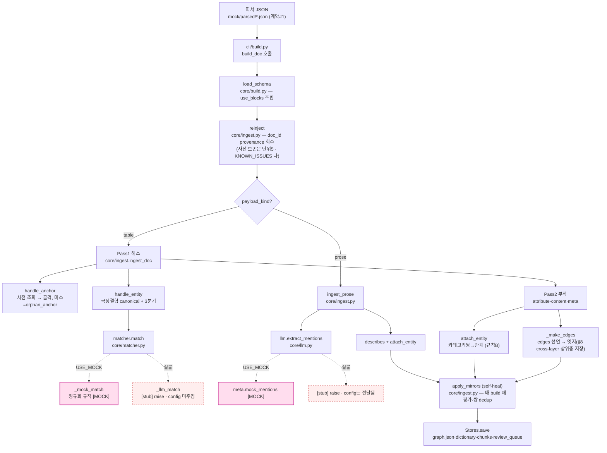
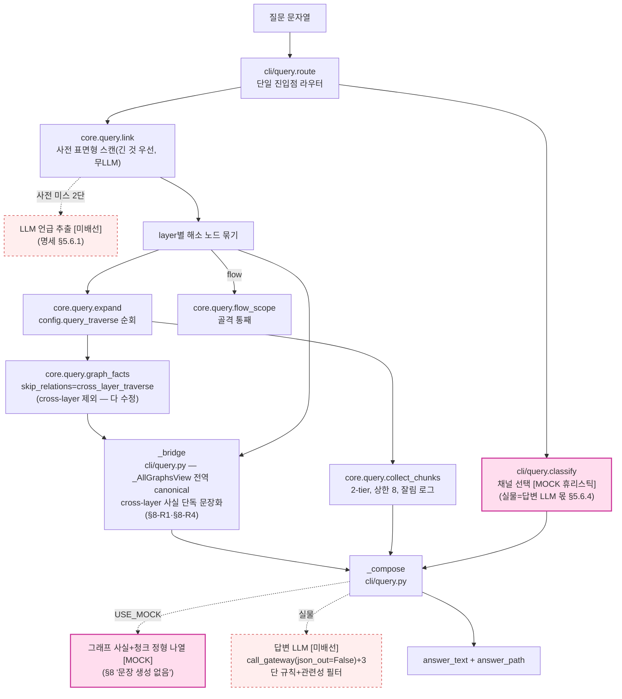
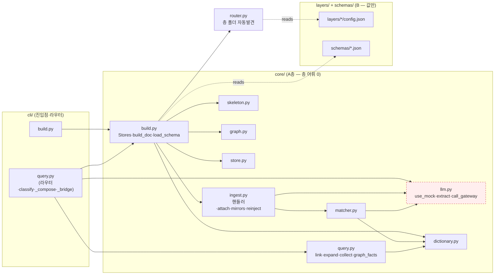

# ARCHITECTURE — 파이프라인·LLM 배선 지도 (읽기 전용 감사, 코드 근거)

> 목적: (1) 실물 LLM을 붙일 때 **구조가 받아주는지**를 코드로 감사, (2) 인입·질의 파이프라인과 모듈 의존을 Mermaid로 시각화.
> 상태 라벨 — **[MOCK]** 규칙 폴백 구현됨 / **[stub]** 실물 경로가 `raise`만 / **[미배선]** 실물 경로 자체가 없음.
> 대상: 명세 v1.11 / 정의서 v1.7 / 구현문서 v1.10. 근거는 파일:함수:줄.

---

## 1. LLM 배선 가능성 감사

### 1.1 게이트웨이 호출 규약
[`core/llm.py:40`](core/llm.py#L40) `call_gateway(prompt, *, system=None, json_out=True)`:
- 입력 = 단일 `prompt` 문자열(+선택 `system`). payload = `{"model", "system", "prompt"}` → `urllib.request` POST(`LLM_GATEWAY_URL`, Bearer).
- 반환 = `json.loads(body)` (json_out=True) **또는** raw 문자열(json_out=False).
- **범용 골격**: 세 지점 모두에 배선 가능한 형태(프롬프트 in, JSON/문장 out). 단 payload 포맷은 placeholder라 **사내 게이트웨이 실제 스펙에 맞춰 조정 필요**. 현재 **호출자 0**(정의만).

### 1.2 세 LLM 지점 배선 판정

| 지점 | 함수(파일:줄) | 현재 | **config 전달 경로** | **응답 파싱 매칭** | **배선 상태** |
|---|---|---|---|---|---|
| **추출**(prose) | `llm.extract_mentions(chunk, config)` [llm.py:19](core/llm.py#L19) | [MOCK] `meta.mock_mentions` / 실물 [stub] raise:29 | ✅ **끝까지 이어짐** — `ingest.ingest_prose`가 `ctx.config` 전달([ingest.py:324](core/ingest.py#L324)). 정의문=`config.categories`, 규칙=`config.prompts.extract` 손에 있음 | 기대 `{"mentions":[{surface,category}]}` → `call_gateway(prompt)["mentions"]`. json_out=True와 **일치** | **함수만 채우면 됨** — 시그니처·데이터 흐름 준비 완료 |
| **개체 판정** | `matcher.match(surface, candidates, category, threshold)` → `_llm_match` [matcher.py:20,48](core/matcher.py#L20) | [MOCK] 정규화 규칙 / 실물 [stub] raise:50 | ⚠️ **끊김** — `handle_entity`가 `threshold=config.get("match_threshold")`만 전달([ingest.py:121](core/ingest.py#L121)), **config 자체는 안 넘김**. `_llm_match`가 정의문·비대칭 기준(`config.prompts.judge`/`config.categories`)에 **접근 불가** | 기대 `{"type","matched_id","confidence"}` → JSON과 **일치** | **함수 채우기 + 시그니처에 config 주입**(경미 구조변경: `match(...,config)` + 호출 1줄) |
| **답변 생성** | `cli/query._compose(question, path, facts, chunk_ids, s, linked)` [cli/query.py:148](cli/query.py#L148) | [MOCK] 정형 나열 / 실물 **[미배선]** | ⚠️ `cli/query.py`가 **`llm` import 안 함**([cli/query.py:22](cli/query.py#L22)=`build, query`만). 답변 프롬프트 규칙(3단·관련성 필터)은 **코드**(`classify`/`_compose`)에 있고 `config.prompts`엔 `answer` 키 없음 | 기대 = **문장(str)**. `call_gateway` 기본 `json_out=True`면 문장에 `json.loads` → **실패**. **`json_out=False` 필수** | **import llm + 분기 추가 + json_out=False**(+선택 `config.prompts.answer`). 소규모 신설 |

### 1.3 채널 선택·링킹·임베딩 (부속 관측)
- **채널 선택**: [`cli/query.classify`](cli/query.py#L34)의 키워드 휴리스틱이 §5.6.4 "답변 LLM이 채널 고름"을 대체. 실물 답변 LLM 도입 시 이 판단이 LLM으로 흡수될 수 있음(classify는 사전 필터로 잔존 가능).
- **링킹 2단**(사전 미스 시 LLM 언급 추출, §5.6.1): [`core/query.link`](core/query.py#L26)는 사전 스캔(1단)만. 2단 [미배선].
- **임베딩**: `core/embeddings.py` **생성됨**(v1.12 반영 라운드 — embed() 계약: MOCK=sha256 정규화 32차원+경고, 실물=sentence-transformers 지연 import). 단 **후보검색 확장은 미배선** — 판정 후보는 여전히 `dictionary.lookup`(정규화 완전 일치, [ingest.py handle_entity](core/ingest.py))뿐이라 embed()를 소비하는 코드가 없음(FABLE_REVIEW F16 본체, LLM 배선 시점). Q6 하이브리드 서치는 별개 이연(명세 §5.6.6 사다리).

### 1.4 결론 — "함수만 채우면?"
- **추출**: ✅ 순수 함수 채우기(구조 변경 0).
- **판정**: ⚠️ 함수 채우기 + `config` 인자 1개 주입(handle_entity 호출 1줄 수정). 경미.
- **답변**: ⚠️ 신설 — `llm` import + `_compose` 실물 분기 + `json_out=False` + (선택) 답변 프롬프트 config화. 경미.
- **공통**: `call_gateway` payload를 사내 게이트웨이 스펙에 맞춤. 임베딩은 별도 도입.
- **판정 총평**: 세 지점 모두 **대규모 구조 변경 불요**. 추출은 즉시, 판정·답변은 인자 주입·소규모 신설 수준. role 핸들러·2-pass·edges·mirrors·저장 등 **파이프라인 골조는 LLM-독립**이라 실물 전환에도 불변(재검증 대상은 판정 하류 품질 — REVIEW E1·LLM 감사 참조).

---

## 2. 인입(build) 파이프라인

`python -m cli.build <parsed.json>` → [`core.build.build_doc`](core/build.py). LLM 지점 2개(추출·판정).

---

## 3. 질의(query) 파이프라인

`python -m cli.query "<질문>"` → [`cli.query.route`](cli/query.py#L49) (단일 라우터, 명세 §8-R1). LLM 지점: 답변 생성 **[미배선]**, 링킹 2단 [미배선].

---

## 4. 모듈 의존 관계 (core / layers / cli)

단방향 의존(P3): cli → core → (router·graph·dictionary·store·llm). core는 layers를 **모른다**(config를 데이터로만 읽음, §0-2). `llm`은 최말단(외부 의존 지연 격리).

> `cli/query.py --(llm)-->` 점선은 **답변 LLM 배선 시 추가될 의존**(현재 미존재). core.matcher/ingest → llm은 존재하나 실물 분기는 [stub].

---

## 5. 배선 순서 제안 (참고 — 조치는 사람 결정)
1. **추출** `extract_mentions` 실물 분기(정의문 삽입 프롬프트 → `call_gateway` → mentions). 구조 변경 0.
2. **판정** `matcher.match(...,config)` 인자 추가 + `_llm_match` 구현(정의문·비대칭 기준 주입). 호출 1줄.
3. **답변** `cli/query`에 `llm` import + `_compose` 실물 분기(`json_out=False`) + (선택) `config.prompts.answer`.
4. **게이트웨이 payload**를 사내 스펙에 맞춤(공통).
5. **임베딩**(`core/embeddings.py`) 도입 — 판정 후보검색·Q6 하이브리드(별개, 명세 §5.6.6).

_생성: LLM 배선 감사(읽기 전용). 코드 미수정._
